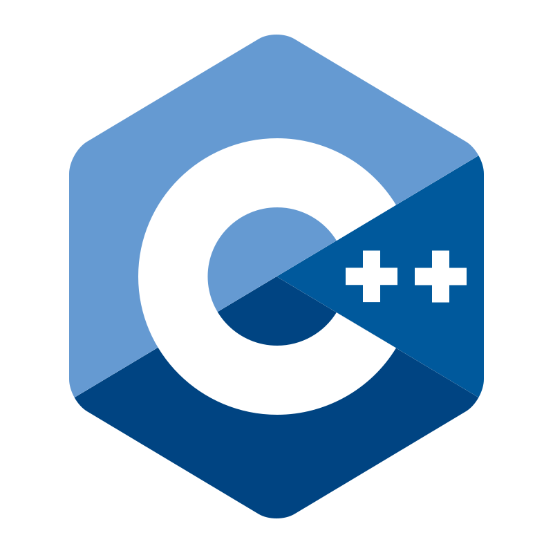
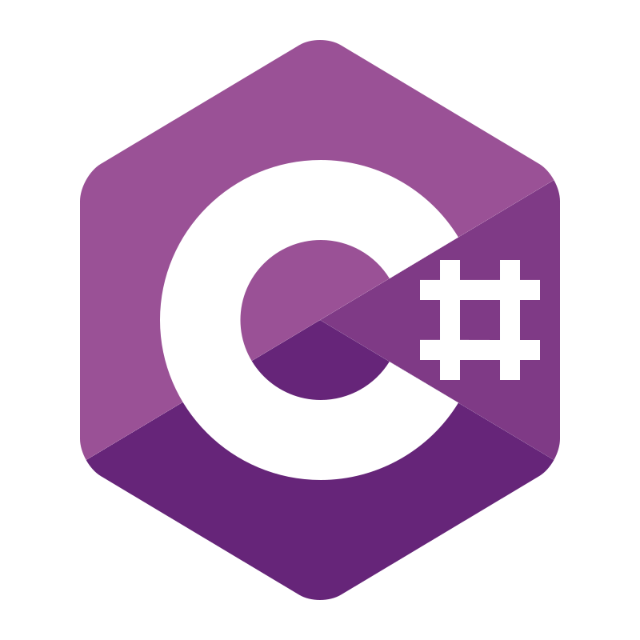

  <h2>  Olá, seja muito bem-vindo(a) ao meu perfil!</h2>
  
  
Sou <b>Nathan Lucas</b>, desenvolvedor de software e técnico em automação industrial, apaixonado por construir a ponte entre o mundo digital e o físico.

---

### ⌨️ O que eu faço:
*  **Convergência IT/OT:**  Integração avançada entre sistemas de controle industrial e arquiteturas de software modernas.
*  **Desenvolvimento fullstack & Sistemas:**  Criação de aplicações robustas e escaláveis utilizando C++, C#, Java e Python.
*  **Automação & IIoT:**  Projetos com CLPs e HMIs (TIA Portal, Studio 5000, CODESYS), Factory I/O, Modbus TCP e simulações via NetToPLCSIM.

---

  <h2>LINGUAGENS</h2>
  
  
  
  
  
  

  <h2>FRAMEWORKS</h2>
  
  
  
  

  <h2>BANCO DE DADOS</h2>
  
  
  

  <h2>CLOUD</h2>
  
  
  

  <h2>LinkedIn</h2>
  

